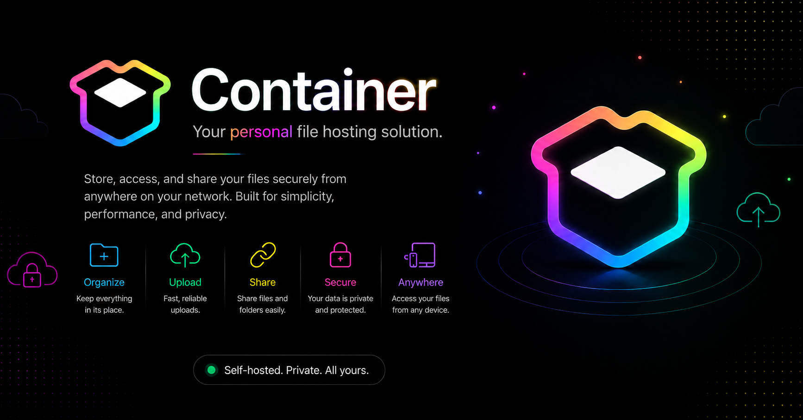
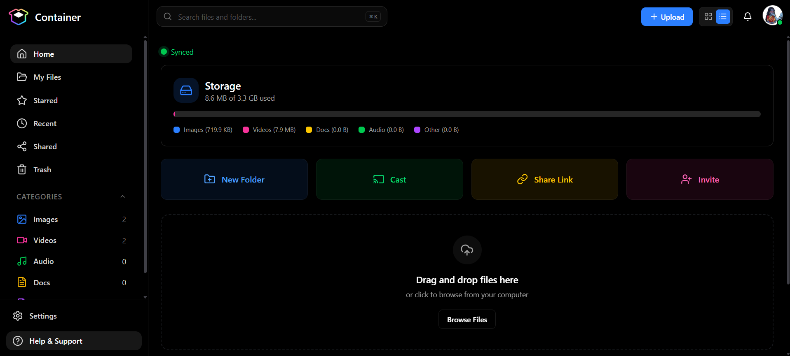

<div>

# 📦 Container

### Your Personal File Storage & Management Platform

A modern, full-stack file hosting and management application built for managing files, folders, storage, and devices in one place.


<br />



<br />


CONTAINER is more than just the name of the application. It represents the core purpose of the platform:  <br /> <br />
C - Centralized <br />
O - Organization & <br />
N - Networked <br />
T - Transfer for <br />
A - Accessible <br />
I - Information, <br />
N - Navigation, <br />
E - Exchange & <br />
R - Repositories <br />
<br />

**Upload. Organize. Access. Anywhere.**

[Features](#-features) •
[Installation](#-installation--setup) •
[Tech Stack](#-tech-stack) •
[Authentication](#-authentication--security) •
[Screenshots](#-screenshots) •
[Contributing](#-contributing)

</div>

---

## 📖 About Container

**Container** is a modern full-stack **File Hosting and File Management Web Application** designed to make your old pc into personal or server-side storage simple and powerful.

It provides a clean interface for uploading, organizing, previewing, downloading, and managing files and folders.

With **real-time synchronization powered by Socket.IO**, changes are instantly reflected across connected devices — without refreshing the page.

Whether you're building a personal NAS, self-hosted storage solution, or a powerful file manager, **Container** provides the foundation.

---

# ✨ Features

## 📁 File Management

* 📤 Upload single or multiple files
* 📊 Real-time upload progress for each file
* 📥 Download files
* ✏️ Rename files and folders
* 🗑️ Delete files and folders
* ❤️ Mark files as favorites
* 🔎 Search files quickly
* ↕️ Sort files by different criteria
* 📂 Create and manage virtual folders
* 🧭 Navigate using breadcrumbs
* 🗂️ Grid and list view support

---

## 👁️ File Preview

Preview supported files directly inside the application.

Supported previews include:

* 🖼️ Images
* 🎬 Videos
* 🎵 Audio files
* 📄 PDF documents
* 📝 Text files

No need to download a file just to see what's inside.

---

## ⚡ Real-Time Updates

Container uses **Socket.IO** to keep connected devices synchronized.

Real-time events include:

* 📤 File uploads
* 🗑️ File deletion
* ✏️ File renaming
* 📁 Folder creation and updates
* 👤 Session updates
* 🚪 Remote logout
* 💾 Storage updates
* 🖥️ Drive status updates
* ⚙️ Settings synchronization

✨ **No manual page refresh required.**

---

## 🔐 Authentication & Security

Container includes a modern authentication and session management system.

* 🔑 JWT-based authentication
* 🍪 HTTP-only authentication cookies
* 🖥️ Multi-device session tracking
* 📱 Device information detection
* 🌐 IP address tracking
* 🚪 Remote device logout
* ⚡ Real-time automatic logout

---

## 📊 Storage Dashboard

Monitor your storage from a single dashboard.

* 💾 Storage usage statistics
* 📈 Used and available space
* 🖥️ Multiple drive support
* 📂 File and folder statistics
* ⚡ Drive health and latency monitoring

---

## 📱 Responsive Design

Container is designed to work across different screen sizes.

* 💻 Desktop
* 📱 Mobile
* 📟 Tablet

The interface automatically adapts for a smooth experience on every device.

---

# 🛠️ Tech Stack

## 🎨 Frontend

| Technology          | Purpose                 |
| ------------------- | ----------------------- |
| ⚛️ React.js         | User Interface          |
| 🎨 Tailwind CSS     | Styling                 |
| 🔄 React Router DOM | Routing                 |
| 📡 Axios            | API Requests            |
| 🗃️ Zustand         | State Management        |
| ⚡ Socket.IO Client  | Real-Time Communication |
| 🎬 Framer Motion    | Animations              |

---

## ⚙️ Backend

| Technology       | Purpose                 |
| ---------------- | ----------------------- |
| 🟢 Node.js       | Runtime Environment     |
| 🚂 Express.js    | Backend Framework       |
| 🍃 MongoDB       | Database                |
| 🦫 Mongoose      | MongoDB ODM             |
| 📤 Multer        | File Upload Handling    |
| ⚡ Socket.IO      | Real-Time Communication |
| 🔐 JWT           | Authentication          |
| 🍪 Cookie Parser | Cookie Handling         |
| 📧 Nodemailer    | Email Services          |
| 🖥️ ua-parser-js | Device Detection        |
| 🌐 CORS          | Cross-Origin Requests   |
| 🔒 Crypto        | Security Utilities      |

---


# 🚀 Installation & Setup

## 📋 Prerequisites

Make sure you have the following installed:

* Node.js
* npm
* MongoDB

---

## 1️⃣ Clone the Repository

```bash
git clone https://github.com/dipanshu0104/Container.git
cd Container
```

---

# ⚙️ Backend Setup

Navigate to the backend directory:

```bash
cd backend
```

Install dependencies:

```bash
npm install
```

### Create Environment Variables

Create a `.env` file inside the `backend` directory.

```env
# Database

MONGO_URI=your_mongodb_connection_string

# File Upload

UPLOAD_DIR=uploads

# Authentication

JWT_SECRET=your_super_secret_jwt_key

# Email

GMAIL_USER=your_email@gmail.com
GMAIL_PASS=your_gmail_app_password
```

> ⚠️ Never share your `.env` file or commit sensitive credentials to GitHub.

---

# 🎨 Frontend Setup

Navigate to the frontend directory:

```bash
cd frontend
```

Install dependencies:

```bash
npm install
```

Create a `.env` file inside the frontend directory.

```env
VITE_API_BASE=/api

VITE_USER_API_BASE=/api/auth

VITE_FILE_API_BASE=/api/files
```

---

# ▶️ Running the Application

After completing the setup, return to the main project directory.

```bash
cd ..
```

Start the development server:

```bash
npm run dev
```

The application should now be running in development mode. 🚀

---

# ⚡ How Real-Time Synchronization Works

Container uses **Socket.IO** for real-time communication between the server and connected clients.

When something changes, connected devices receive updates automatically.

```text
User Action
    │
    ▼
Backend Server
    │
    ▼
Socket.IO Event
    │
    ▼
Connected Devices
    │
    ▼
Automatic UI Update
```

### Real-Time Events

* 📤 File uploaded
* 🗑️ File deleted
* ✏️ File renamed
* 📂 Folder created
* 🔐 User session updated
* 🚪 Remote logout triggered
* 💾 Storage updated
* 🖥️ Drive status changed

---

# 🔐 Authentication & Security

Container follows a session-aware authentication system.

### Authentication Flow

```text
User Login
    │
    ▼
Credentials Verified
    │
    ▼
JWT Generated
    │
    ▼
Stored in HTTP-Only Cookie
    │
    ▼
Session Created
    │
    ▼
User Authenticated
```

### Session Management

Every login session can track information such as:

* 💻 Device
* 🌐 IP Address
* 🖥️ Operating System
* 🌍 Browser
* 📅 Login Time

Users can manage active sessions and remotely log out other devices.

---

# 📸 Screenshots

<div align="center">

### Container Dashboard



</div>

---

# 🧠 Future Improvements

Container is continuously evolving. Some planned features include:

* 👥 Role-Based Access Control
* ☁️ Cloud Storage Integration
* Amazon S3 Support
* Google Drive Integration
* 🧾 Activity Logs
* 🔗 Advanced File Sharing
* 📤 Resumable Uploads
* 🔄 File Synchronization
* 🖥️ Desktop Application
* 📱 Mobile Application
* 🌐 Remote Storage Access

---

# 🤝 Contributing

Contributions are always welcome!

If you'd like to contribute:

### 1. Fork the repository

### 2. Create a new branch

```bash
git checkout -b feature/your-feature-name
```

### 3. Make your changes

### 4. Commit your changes

```bash
git commit -m "Add your feature"
```

### 5. Push to your branch

```bash
git push origin feature/your-feature-name
```

### 6. Open a Pull Request

---

# 📄 License

This project is licensed under the **MIT License**.

You are free to use, modify, and distribute this project according to the terms of the license.

---

# 👨‍💻 Author

<div align="center">

## Dipanshu Kumar

Developer & Creator of Container

🐙 **GitHub:** [@dipanshu0104](https://github.com/dipanshu0104)

</div>

---

<div align="center">

### ⭐ If you like Container, consider giving the repository a star!

It helps support the project and motivates future development. ❤️

<br />

**Built with ❤️ using the MERN Stack**

</div>
